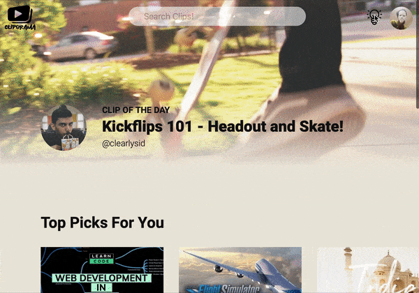
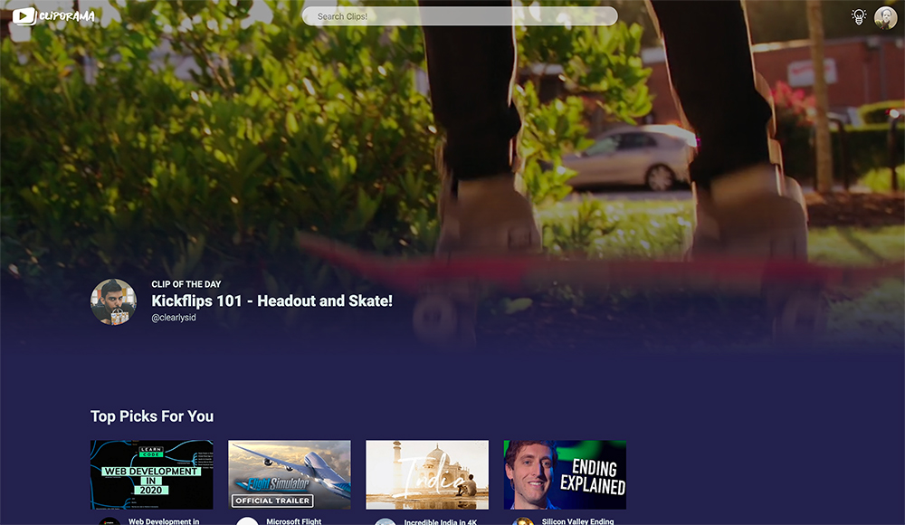

# Cliporama (clip-o-rama)
A simple video-sharing platform homepage. I made heavy use of both Flexbox and Grid for this one along with some super-simple Javascript to make a "fade-in-on-page-load" effect and to toggle classes for switching light/dark modes. It works pretty well across most devices, and was really fun to build!

### Repo Contains
1. Source Code for the homepage
2. All Assets used
3. imagesloaded library
    - non-essential, but I used this tiny library to check if images have been loaded
4. Rough Draft Sketches
5. Screenshots of Homepage

### Result
Fairly satisfied with a good few hours of work, though there's a lot that can be done better.

A quick sketch of where I wanted to place things, before I actually started to code.

### Features that were fun to code
* Initial fade in animation
* Hover effects on thumbnails
* Dark/Light mode switching
* Horizontal scrolling divs

### Not so fun..
* Not happy with the typography scaling, it could be a lot smoother.
* Video does not autoplay on some browsers
* Looking for content to put inside site
  * Should have just used javascript objects to insert content in placeholders.
* Learnt that CSS gradients cannot be transitioned :(
* Keeping track of z-indexes is a huge pain!

