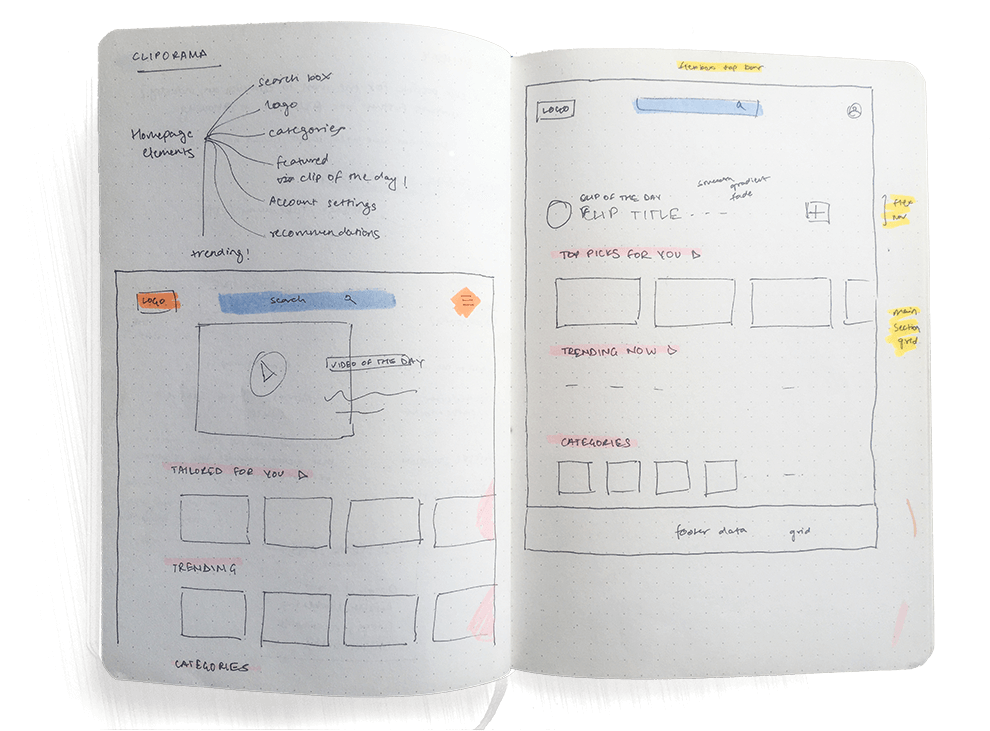
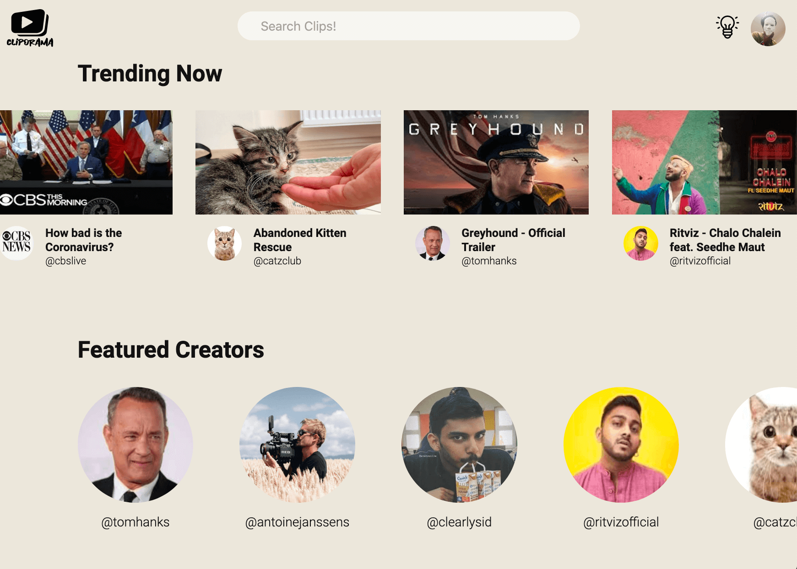

# Cliporama
A simple video-sharing platform homepage.

### Repo Contains
* Source Code for the homepage
* All Assets used
* imagesloaded library
* Rough Draft Sketches
* Screenshots of Homepage

###

### Result
Fairly satisfied with a good few hours of work, though there's a lot that can be done better.

### Features that were fun to code
* Initial fade in animation
* Hover effects on thumbnails
* Dark/Light mode switching
* Horizontal scrolling divs

### Not so fun..
* Not happy with the typography scaling, it could be a lot smoother.
* Video does not autoplay on some browsers
* Looking for content to put inside site
  * Should have just used javascript objects to insert content in placeholders.
* Learnt that CSS gradients cannot be transitioned :(
* Keeping track of z-indexes is a huge pain!

